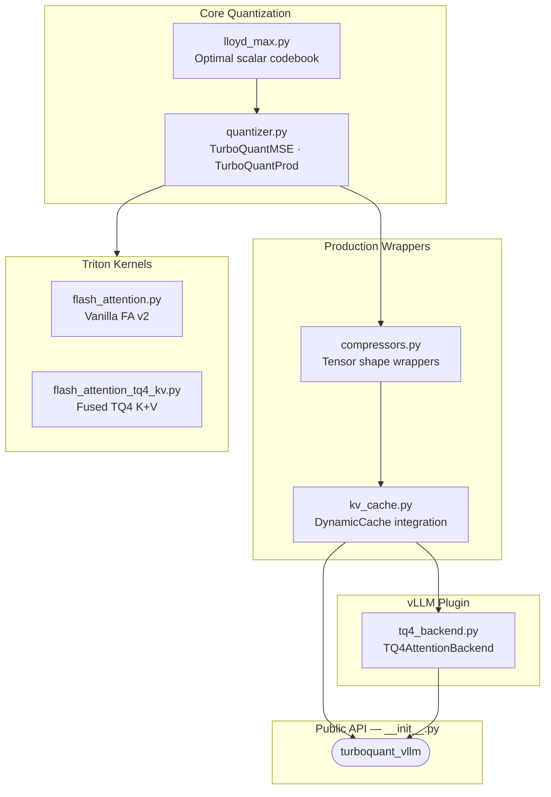

# Architecture

## Module Map



## Dependency Flow

Strict DAG — no circular dependencies:

```
lloyd_max → quantizer → compressors → kv_cache → benchmark
                 ↓
            triton/ (fused GPU kernels)
                 ↓
            vllm/ (serving plugin)
```

## Data Flow

### Compression (cache.update)

```
input tensor (batch, heads, seq, head_dim)
    → normalize (extract fp32 norms)
    → rotate (Haar-random orthogonal matrix)
    → quantize (Lloyd-Max codebook lookup → uint8 indices)
    → nibble pack (two 4-bit indices per byte)
    → store (uint8 indices + fp32 norms)
```

### Decompression (cache read)

```
stored (uint8 indices + fp32 norms)
    → nibble unpack
    → centroid lookup (uint8 → float via codebook)
    → inverse rotate
    → scale (multiply by stored norms)
    → output tensor (original dtype)
```

## Design Decisions

| Decision | Rationale |
|----------|-----------|
| MSE-only for drop-in mode | QJL correction invisible to standard `Q @ K.T` attention |
| TQ4 nibble packing over TQ3 | Trivial pack/unpack, 3.76x compression, ~97% quality |
| fp32 norms, not fp16 | fp16 precision loss compounds across 36 layers at 10K+ tokens |
| Non-invasive monkey-patching | Avoids subclassing DynamicCache across transformers versions |
| `@lru_cache` on Lloyd-Max | 64 compressor instances share one codebook computation |
| Incremental dequantization | Only new tokens dequantized per decode step |

For the full architecture deep-dive, see [docs/ARCHITECTURE.md](https://github.com/Alberto-Codes/turboquant-vllm/blob/main/docs/ARCHITECTURE.md).
